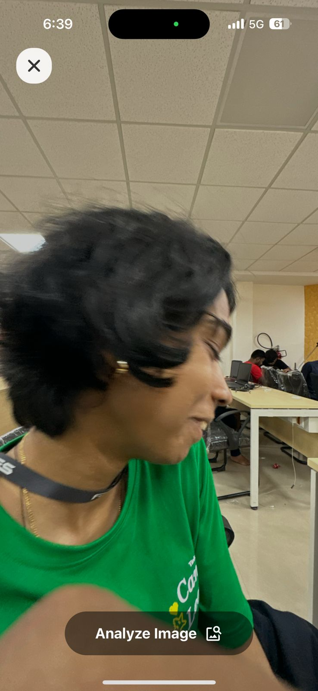
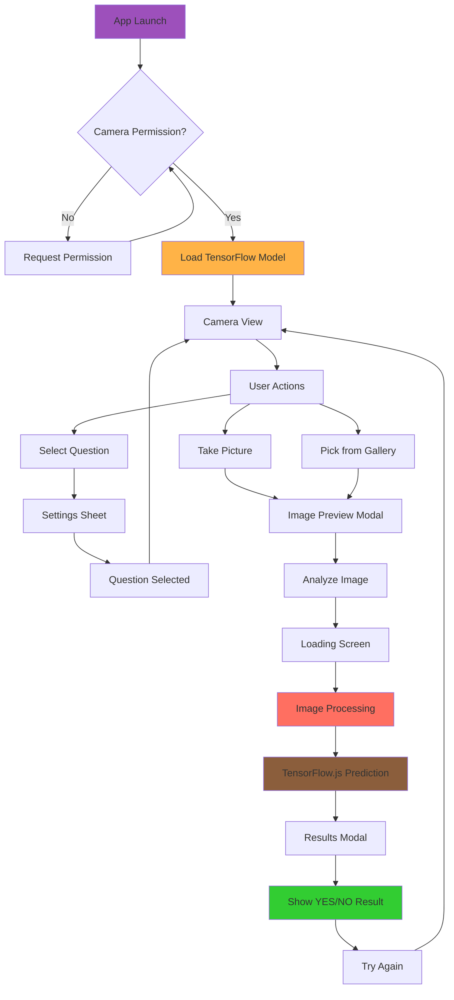

# is-it 🎯


## Basic Details
### Team Name: delulu


### Team Members
- Member 1: Mahadevan Reji - College of Engineering Chengannur
- Member 2: Neil Oommen Renni - College of Engineering Chengannur

### Project Description
is-it is a revolutionary mobile app that leverages the power of Artificial Intelligence to answer life's most pressing, albeit useless, questions. Point your camera at an object, select a question, and our advanced ML model will give you the definitive "YES!" or "NOPE!" you've been searching for.

### The Problem (that doesn't exist)
Have you ever stared deep into your lunch, pondering the existential question, "Is this truly Biryani?". Have you ever wondered if that comfy-looking thing is, in fact, "sittable?". The uncertainty is maddening! Society has long been plagued by the inability to definitively categorize the mundane objects around us.

### The Solution (that nobody asked for)
We built "is-it," a mobile application that eradicates these useless dilemmas. Using a sophisticated TensorFlow.js model integrated into a React Native app, we provide instant, confident answers. The app allows you to use your camera or gallery to select an image, choose from a list of profound questions, and receive an AI-generated verdict, restoring peace and certainty to your life.

## Technical Details
### Technologies/Components Used
For Software:
- Languages used: TypeScript
- Frameworks used: React Native, Expo
- Libraries used:
  - @tensorflow/tfjs, @tensorflow/tfjs-react-native for on-device machine learning
  - expo-camera for live camera feed and controls
  - expo-image-picker to select images from the gallery
  - react-native-reanimated for smooth animations
  - expo-gl for WebGL backend for TensorFlow.js
- Tools used: Expo CLI, EAS Build

For Hardware:
- Not Applicable (This is a software-only project)

### Implementation
For Software:
# Installation
```bash
# Clone the repository
git clone https://github.com/kichu12348/is-it.git
cd is-it

# Install dependencies
npm install
```

# Run
```bash
# Start the development server
npx expo start
```

### Project Documentation
For Software:

# Screenshots (Add at least 3)

*The main app interface, showing the live camera view with "Analyze Image" button. The user can take selfies or photos of objects to analyze.*


*The loading screen displaying "Consulting MasterChef..." while the Model processes the image, shown here analyzing what appears to be a hooman(our timkerhub campus lead).*


*The results modal, displaying a confident "YES!" with "I'm about 100% sure." message after the image analysis is complete, along with a "Try Again" option.*

# Diagrams


**App Architecture Flow:**
1. **Initialization**: App launches → requests camera permissions → loads TensorFlow model
2. **Camera Interface**: User sees live camera feed with controls for taking pictures, gallery access, and question selection
3. **Image Capture**: User takes a photo or selects from gallery → image preview with analysis option
4. **AI Processing**: Image gets processed → resized to 224x224 → fed to TensorFlow model → generates prediction array
5. **Results Display**: AI confidence scores are interpreted → displays "YES!" or "NOPE!" with confidence percentage
6. **Retry Loop**: User can try again with new images or different questions

For Hardware:
- Not Applicable

### Project Demo
# Video
[Demo Video](https://drive.google.com/file/d/1xb3pTjMfJPhpkvktKxNccwmzlW3f3Sd2/view?usp=sharing)
*The video demonstrates the full user journey: launching the app, selecting a question, taking a picture, running the analysis, and viewing the final result. It also shows the gallery access and camera switching features.*

# Additional Demos
[Add any extra demo materials/links]

## Team Contributions
- Mahadevan Reji: Led the integration of the TensorFlow model, developed the core prediction and image processing logic (src/brain/), and managed the application's state using React Context (src/context/AppContext.tsx)
- Neil Oommen Renni: Designed and implemented the user interface and component architecture, including the camera view, modals, and control elements (src/components/), handled the overall UX and styling (src/components/styles.ts) and trained the model.

---
Made with ❤️ at TinkerHub Useless Projects 


